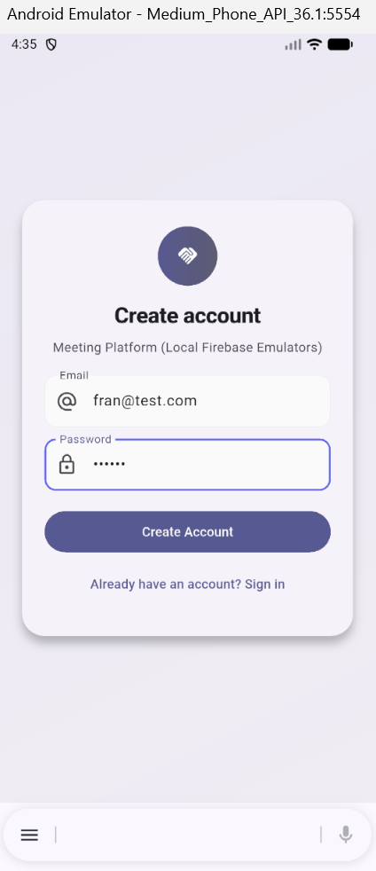
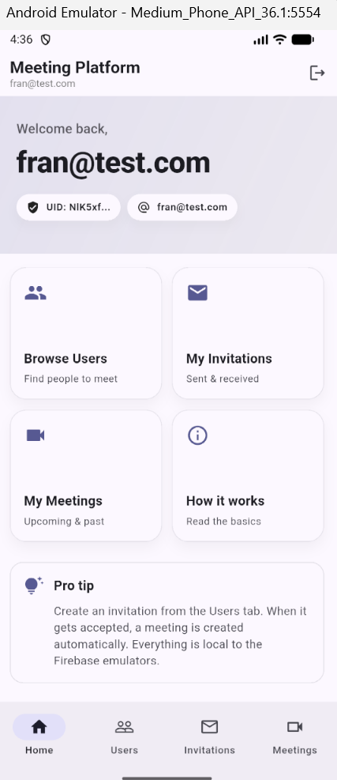
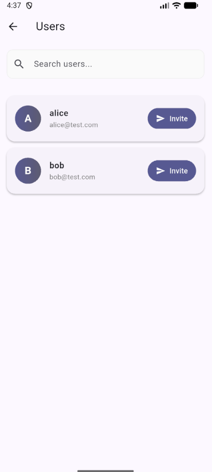
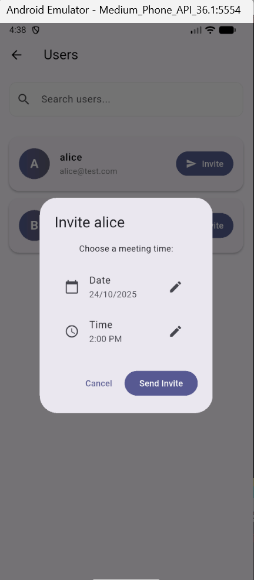
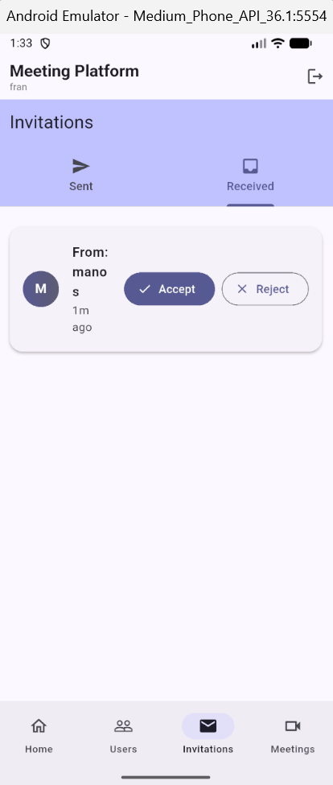
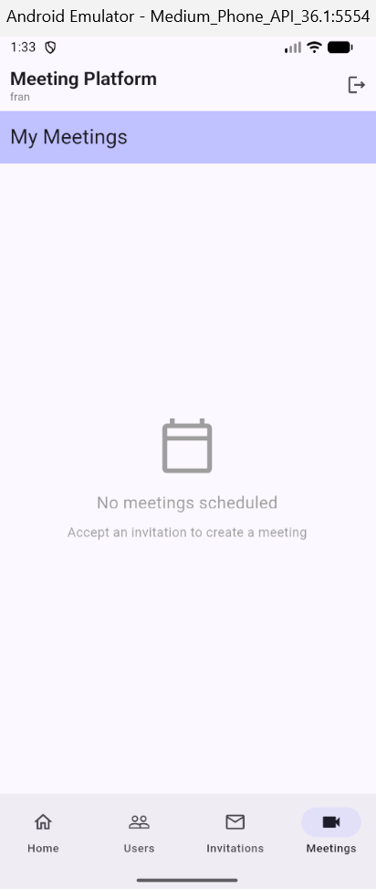

# Meeting Platform

A Flutter mobile application for scheduling meetings between team members, built with Firebase Emulator Suite for local development.

  

## Screenshots

<table>
  <tr>
    <td align="center"><br/><b>Login & Registration</b></td>
    <td align="center"><br/><b>Home Dashboard</b></td>
    <td align="center"><br/><b>Users List</b></td>
  </tr>
  <tr>
    <td align="center"><br/><b>Send Invitation</b></td>
    <td align="center"><br/><b>Invitations</b></td>
    <td align="center"><br/><b>Meetings</b></td>
  </tr>
</table>

## Technology Stack

- **Frontend:** Flutter (Dart 3.9.2)
- **Backend:** Firebase (Authentication, Firestore, Cloud Functions)
- **State Management:** Riverpod
- **Development:** Firebase Emulator Suite (fully local)
- **UI:** Material Design 3

## Features Implemented

✅ **User Authentication**
- Email/password sign up and sign in
- Firebase Auth Emulator integration
- Secure session management

✅ **Users Management**
- View all registered users (excluding yourself)
- Real-time search functionality
- Modern card-based UI with gradient avatars

✅ **Meeting Invitations**
- Send invitations with date/time picker
- Tabbed interface (Sent / Received)
- Accept or reject invitations
- Real-time updates via Firestore streams
- Status badges (Pending, Accepted, Rejected)

✅ **Meetings Dashboard**
- View scheduled meetings
- Calendar view for upcoming meetings
- Edit meeting times
- Empty states with helpful guidance

✅ **Modern UI/UX**
- Bottom navigation (Home / Users / Invitations / Meetings)
- Material 3 design system
- Search functionality
- Dark mode support
- Responsive layouts
- Smooth animations

## Architecture

### Project Structure
```
meeting_platform/
├── lib/
│   ├── features/
│   │   ├── auth/              # Authentication (login, sign up, providers)
│   │   ├── users/             # Users list, search, main navigation
│   │   ├── invitations/       # Send/receive invitations
│   │   └── meetings/          # Meetings list and calendar view
│   ├── models/                # Data models (User, Invitation, Meeting)
│   ├── services/              # Business logic (Auth, Users, Invitations, Meetings)
│   └── main.dart              # App entry point, emulator configuration
├── functions/
│   └── index.js               # Cloud Function to auto-create meetings
├── firebase.json              # Firebase configuration
└── docs/
    └── img/                   # Screenshots
```

### Key Architectural Decisions

**1. Feature-Based Organization**
- Code organized by feature (auth, users, invitations, meetings)
- Each feature has its own screens, providers, and logic
- Promotes modularity and maintainability
- Easy to onboard new developers

**2. Riverpod for State Management**
- Reactive UI updates via providers
- Clean separation between UI and business logic
- Easy testing and dependency injection
- Type-safe and compile-time error checking

**3. Service Layer Pattern**
- Services handle all Firebase operations
- Features consume services via providers
- Single source of truth for data operations
- Easy to mock for testing

**4. Firebase Emulator Suite**
- Completely local development (no cloud resources needed)
- Auth, Firestore, and Functions emulators
- Easy to reset and test different scenarios
- Fast iteration without network latency

**5. Cloud Function for Meeting Creation**
- Automatic meeting creation when invitation is accepted
- Keeps client code simple and focused on UI
- Centralized business logic on backend
- Ensures data consistency

## Data Models

### Firestore Collections

**users/** - Stores user profile information
```json
{
  "uid": "string",
  "email": "string",
  "displayName": "string",
  "createdAt": "timestamp"
}
```

**invitations/** - Tracks meeting invitations
```json
{
  "senderId": "string",
  "receiverId": "string",
  "status": "pending | accepted | rejected",
  "scheduledFor": "timestamp | null",
  "createdAt": "timestamp"
}
```

**meetings/** - Stores confirmed meetings
```json
{
  "participants": ["uid1", "uid2"],
  "scheduledFor": "timestamp",
  "createdAt": "timestamp"
}
```

## Prerequisites

- **Flutter SDK:** 3.22 or higher
- **Dart SDK:** 3.0 or higher
- **Node.js:** 18 or higher (for Firebase Functions)
- **Firebase CLI:** Install with `npm install -g firebase-tools`
- **Android SDK:** For Android emulator (or Xcode for iOS simulator)

## Installation & Setup

### 1. Clone the Repository
```bash
git clone https://github.com/franng95/meeting_platform.git
cd meeting_platform
```

### 2. Install Flutter Dependencies
```bash
flutter pub get
```

### 3. Install Firebase Functions Dependencies
```bash
cd functions
npm install
cd ..
```

### 4. Start Firebase Emulators

Open a terminal and run:
```bash
firebase emulators:start --only auth,firestore,functions
```

**Expected output:**
```
✔  All emulators ready!
┌─────────────┬────────────────┬─────────────────────────────────┐
│ Emulator    │ Host:Port      │ View in Emulator UI             │
├─────────────┼────────────────┼─────────────────────────────────┤
│ Auth        │ 127.0.0.1:9099 │ http://localhost:4000/auth      │
│ Firestore   │ 127.0.0.1:8080 │ http://localhost:4000/firestore │
│ Functions   │ 127.0.0.1:5001 │ http://localhost:4000/functions │
└─────────────┴────────────────┴─────────────────────────────────┘
```

The Emulator UI will be available at **`http://localhost:4000`**

### 5. Run the Application

**In a NEW terminal** (keep emulators running):
```bash
flutter run
```

**For specific device:**
```bash
# Android emulator
flutter run -d emulator-5554

# iOS simulator  
flutter run -d iPhone

# Chrome (web)
flutter run -d chrome
```

## Testing the Application

### Quick Start - Create Test Users

1. Launch the app
2. Click **"Create Account"**
3. Create at least 2 test users:
   - **Alice:** alice@test.com / password123
   - **Bob:** bob@test.com / password123
   - **Charlie:** charlie@test.com / password123

### Complete User Flow

**Scenario: Alice invites Bob to a meeting**

1. **Sign in as Alice** (alice@test.com)
2. Tap on **"Browse Users"** card (or use bottom navigation)
3. Use the search bar to find Bob (optional)
4. Click **"Invite"** button on Bob's card
5. Select a date and time in the dialog
6. Click **"Send Invite"**
7. See confirmation message
8. **Sign out** (logout icon in app bar)

9. **Sign in as Bob** (bob@test.com)
10. Navigate to **"Invitations"** → **"Received"** tab
11. See Alice's invitation with scheduled time
12. Click **"Accept"** button
13. Navigate to **"Meetings"** tab
14. View the scheduled meeting (if Cloud Function triggered successfully)

### Verify in Emulator UI

Open **`http://localhost:4000`** in your browser to inspect:

- **Authentication Tab:** See registered users (Alice, Bob, Charlie)
- **Firestore Tab:** Browse collections
  - `users/` - All user documents
  - `invitations/` - Sent invitations with statuses
  - `meetings/` - Created meetings (if function triggered)
- **Functions Tab:** View logs showing meeting creation triggers

## Known Issues

### Emulator Connection Stability

On some Windows/Android development setups, there can be occasional connectivity issues between the Android emulator and the Firebase Emulator Suite running on localhost.

**Symptoms:**
- Data appears in the app but not immediately in Emulator UI
- Cloud Function triggers but meetings don't appear instantly
- Firestore streams occasionally disconnect

**Root Cause:**
This is a known limitation of the Android emulator's network bridge to localhost (`10.0.2.2`), particularly on Windows systems.

**Workarounds:**
1. Restart the Firebase emulators: `Ctrl+C` then `firebase emulators:start`
2. Perform a hot restart in Flutter: Press `R` in the terminal
3. Verify emulators are accessible at `http://localhost:4000`
4. Check Windows Firewall isn't blocking localhost ports

**Note:** This issue does not occur in production Firebase deployments and is purely an emulator environment quirk.

## Assumptions Made

- **Authentication:** Users only need email/password authentication (no OAuth providers)
- **Meeting Participants:** Each meeting involves exactly 2 participants
- **Meeting Creation:** The Cloud Function automatically creates meetings when invitations are accepted
- **Meeting Management:** Meetings can be edited but not deleted (business rule)
- **Timezone:** All times are stored in UTC and displayed in device's local timezone
- **Development Environment:** The evaluator has Android SDK or iOS simulator available
- **Email Verification:** Not required for demo purposes
- **User Profiles:** Basic profile info (no photos, bios, etc.)

## Ideas for Future Improvements

**If given more time to expand this project:**

### 1. Enhanced Meeting Features
- Add meeting notes/agenda editor
- Support for recurring meetings (daily, weekly, monthly)
- Meeting cancellation with automatic notifications
- Meeting history and analytics
- Multi-participant meetings (3+ people)

### 2. Real-time Communication
- In-app chat per meeting room
- Video call integration (Jitsi Meet or WebRTC)
- Push notifications for new invitations
- Email notifications for meeting reminders
- Desktop notifications

### 3. User Experience
- Profile pictures with image upload to Firebase Storage
- User availability calendar (working hours)
- Meeting conflict detection and warnings
- Smart scheduling suggestions
- Meeting reminders (15 min, 1 hour, 1 day before)

### 4. Technical Improvements
- Comprehensive unit tests (models, services)
- Widget tests for key screens
- Integration tests for full user flows
- CI/CD pipeline with GitHub Actions
- Error boundary and Crashlytics integration
- Offline support with local caching
- Performance monitoring

### 5. Admin & Analytics
- Admin dashboard for user management
- Meeting analytics (most active users, peak times)
- Meeting room resources management
- Company-wide calendar view
- Export meeting data to CSV

### 6. Additional Features
- Calendar integration (Google Calendar, Outlook)
- Time zone aware scheduling
- Meeting templates
- Waiting room for meetings
- Screen sharing capability

## Project Context

This project was completed as a **technical assessment for an internship position**, demonstrating:

- ✅ Full-stack mobile development with Flutter
- ✅ Firebase integration (Auth, Firestore, Functions)
- ✅ Clean architecture and code organization
- ✅ Modern UI/UX design with Material 3
- ✅ State management with Riverpod
- ✅ Cloud Functions implementation
- ✅ Real-time data synchronization
- ✅ Professional documentation

**Development Timeline:** Completed within assessment timeframe  
**Code Quality:** Production-ready structure with clear separation of concerns  
**Scalability:** Architecture supports easy addition of new features

## Troubleshooting

### Emulators won't start
```bash
# Check if ports are already in use
netstat -ano | findstr :8080
netstat -ano | findstr :9099

# Kill processes if needed, then restart
firebase emulators:start --only auth,firestore,functions
```

### App can't connect to emulators
- Ensure emulators are running (`http://localhost:4000` accessible)
- For Android: The app uses `10.0.2.2` (emulator's host mapping)
- For iOS simulator: Change to `127.0.0.1` in `main.dart`
- For physical device: Use your computer's LAN IP address

### Flutter build errors
```bash
flutter clean
flutter pub get
flutter run
```

### Function not triggering
- Check Functions tab in Emulator UI for errors
- Verify function is deployed: Should see it in `http://localhost:4000/functions`
- Check logs in Emulator UI when accepting an invitation

## License

MIT License - See LICENSE file for details

## Contact

**Francisco Navarro**
- **Email:** frannavarrogil@gmail.com
- **GitHub:** [@franng95](https://github.com/franng95)
- **LinkedIn:** [Your LinkedIn] *(optional)*

## Acknowledgments

- Flutter Team for excellent documentation
- Firebase Team for the robust Emulator Suite
- Riverpod maintainers for clean state management
- Technical assessment reviewers for the opportunity

---

**Built with ❤️ using Flutter & Firebase**

*Last updated: October 17, 2025*